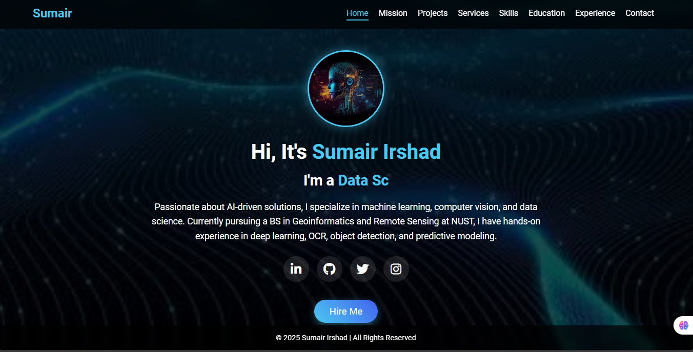

# 🌐 Personal Portfolio Website

🚀 A fully responsive and interactive personal portfolio website built with **HTML**, **CSS**, and **JavaScript** to showcase my projects, skills, and resume.

---

## 📸 Preview

  
*A glimpse of the homepage*

---

## 🛠️ Technologies Used

- 💻 HTML5  
- 🎨 CSS3  
- ⚙️ JavaScript (Vanilla)  
- 📱 Responsive Design with Flexbox/Grid  
- 🌈 Google Fonts & Font Awesome Icons  

---

## 📂 Folder Structure

📁 portfolio-website/ ├── 📄 index.html ├── 📁 css/ │ └── style.css ├── 📁 js/ │ └── main.js ├── 📁 images/ │ └── (your images) └── 📄 README.md

yaml
Copy
Edit

---

## 🎯 Features

- 💼 Project showcase section  
- 🧠 Skills section with icons  
- 📜 Resume download button  
- ✉️ Contact form with validation  
- 🌙 Light/Dark theme toggle (optional)  
- 🔄 Smooth scroll and animations  

---

## 🌍 Live Demo

👉 [View Live Website](https://your-username.github.io/portfolio-website)

---

## 🖼️ Screenshots

| Desktop View | Mobile View |
|--------------|-------------|
|  |  |

---

## 🧾 How to Use

1. **Clone this repo:**
   ```bash
   git clone https://github.com/your-username/portfolio-website.git
Open index.html in browser
You’re good to go!

📝 Customization Tips
Replace profile image, texts, and links with your own.

Add your projects in the Projects section.

Update your contact details in the Contact section.

(Optional) Add more pages like Blog, Certifications, etc.

📬 Contact Me
📧 Email: your.email@example.com
🔗 LinkedIn: linkedin.com/in/yourname
🐙 GitHub: github.com/your-username

🙌 Acknowledgements
Inspired by various modern portfolio designs on GitHub and CodePen.

Icons by Font Awesome

📄 License
This project is open-source and available under the MIT License.

yaml
Copy
Edit

---

Let me know if you'd like to add dark mode, animation libraries, or integrate it with a backend contact form!


You said:
combine and give whole in ine file


ChatGPT said:
Here’s your complete README.md file content, all in one ready-to-use format:

markdown
Copy
Edit
# 🌐 Personal Portfolio Website

🚀 A fully responsive and interactive personal portfolio website built with **HTML**, **CSS**, and **JavaScript** to showcase my projects, skills, and resume.

---

## 📸 Preview

  
*A glimpse of the homepage*

---

## 🛠️ Technologies Used

- 💻 HTML5  
- 🎨 CSS3  
- ⚙️ JavaScript (Vanilla)  
- 📱 Responsive Design with Flexbox/Grid  
- 🌈 Google Fonts & Font Awesome Icons  

---

## 📂 Folder Structure

📁 portfolio-website/ ├── 📄 index.html ├── 📁 css/ │ └── style.css ├── 📁 js/ │ └── main.js ├── 📁 images/ │ └── (your images) └── 📄 README.md

yaml
Copy
Edit

---

## 🎯 Features

- 💼 Project showcase section  
- 🧠 Skills section with icons  
- 📜 Resume download button  
- ✉️ Contact form with validation  
- 🌙 Light/Dark theme toggle (optional)  
- 🔄 Smooth scroll and animations  

---

## 🌍 Live Demo

👉 [View Live Website](https://your-username.github.io/portfolio-website)

---

## 🖼️ Screenshots

| Desktop View | Mobile View |
|--------------|-------------|
|  |  |

---

## 🧾 How to Use

1. **Clone this repo:**
   ```bash
   git clone https://github.com/your-username/portfolio-website.git
Open index.html in your browser
You’re good to go!

📝 Customization Tips
Replace profile image, texts, and links with your own.

Add your projects in the Projects section.

Update your contact details in the Contact section.

(Optional) Add more pages like Blog, Certifications, etc.

📬 Contact Me
📧 Email: your.email@example.com
🔗 LinkedIn: linkedin.com/in/yourname
🐙 GitHub: github.com/your-username

🙌 Acknowledgements
Inspired by various modern portfolio designs on GitHub and CodePen.

Icons by Font Awesome

📄 License
This project is open-source and available under the MIT License.


Let me know if you'd like this file in `.md` format or zipped with your project structure!
